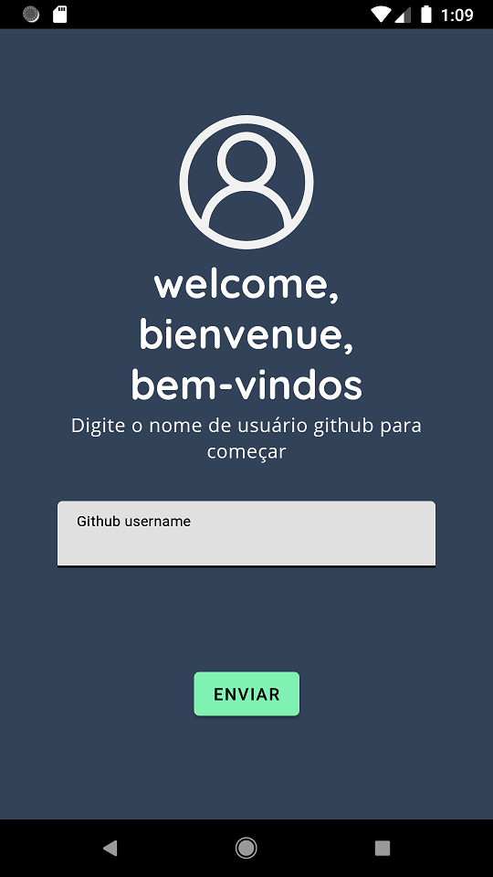
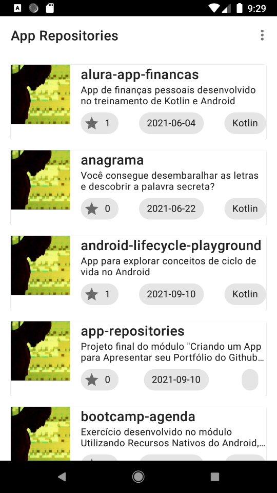
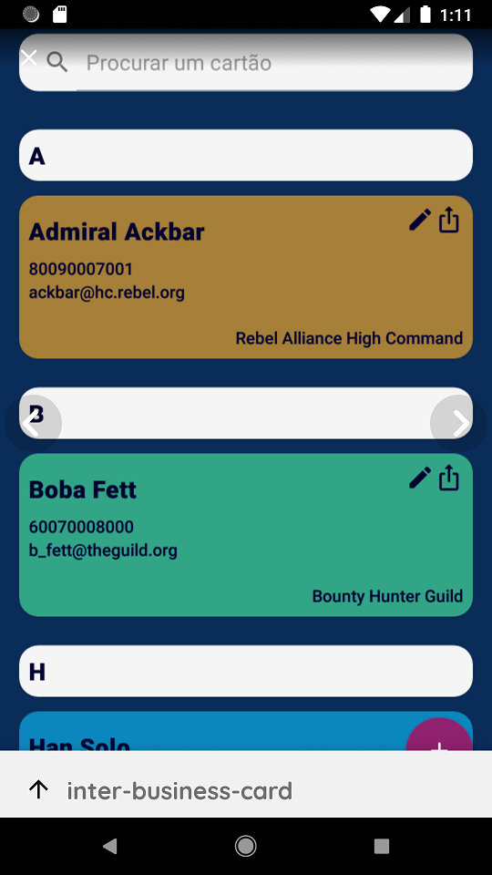
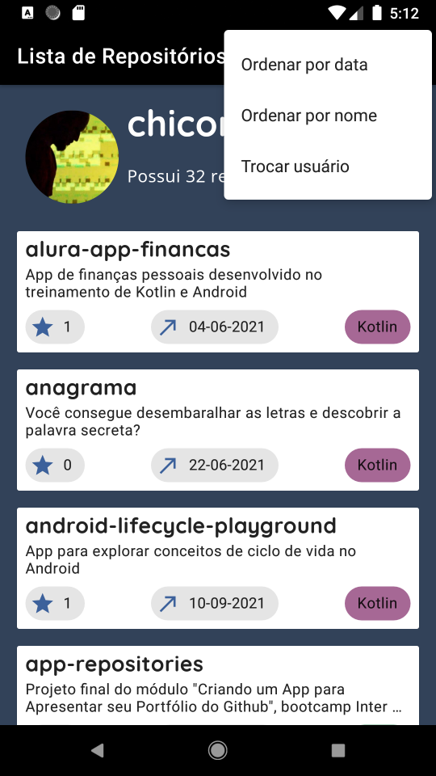
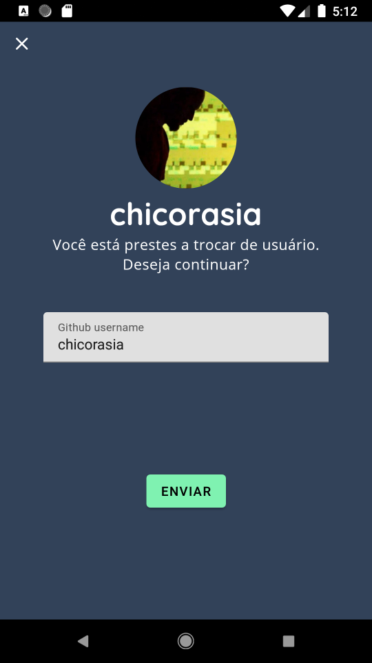
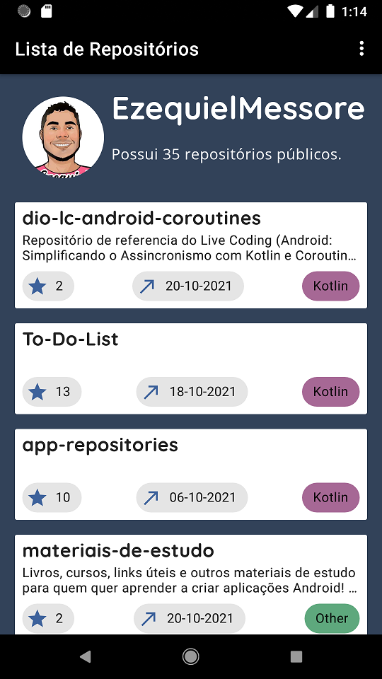

# App-Repositories by Chico Rasia 💻🌎

App desenvolvido como projeto final do módulo ***Criando um App para Apresentar seu Portfólio do GitHub***, instrutor Ezequiel Messore, bootcamp Inter Android Developer na Digital Innovation One.

Além dos conceitos desenvolvidos nas aulas, o app emprega as seguintes tecnologias e soluções:

- **Layout funcional e amigável**. Telas com layout elegante e funcional, aplicando melhores práticas de UI/UX e valorizando as informações do usuário.
- **Tela de entrada / troca de usuário**. Com instruções para entrada dos dados e validação junto à API; erros são informados por meio de `SnackBar`.
- **Verificação de usuário**. O app verifica as informações (username) do usuário no endpoint `users/{username}` da API e somente entra na tela principal após a validação. Essa funcionalidade também possibilita obter mais informações sobre o usuário como, por exemplo, a contagem de repositórios públicos.
- **Persistência de usuário**. Os dados do último usuário consultado ficam gravados no armazenamento local, acelerando o acesso ao se abrir o app novamente.
- **Ordenação dos resultados**. Os resultados da busca podem ser ordenados por nome do Repo ou por data do último *push*. Isso é possível por meio de novas buscas na API, adicionando o parâmetro `sort` conforme indicado na documentação. As chamadas foram encapsuladas numa classe `Query`, o que permite abstrair os parâmetros e reaproveitar a classe `UseCase<Param, Source>`.
- **Estética  *on brand***. Cores, fontes e estilo visual conforme projeto gráfico do app e sua "marca".
- **Uso avançado de string resources**. Uso de *Strings* para a formatação de texto e *string arrays* para a seleção contextual da String.
- ***Chips* expressivos**. Esses elementos da UI são deixados mais comunicativos por meio do uso de cor, ícone e texto. Foi usado `Map<K, V>` para manter as constantes. Isso evita o acoplamento do código do *BindingAdapter* e facilita a adição de mais linguagens e cores.
- **Data do último push**. Usa um Chip para apresentar a data do último push, formatada para o padrão brasileiro.  
- **DataBinding e Listener Bindings**. Adotei essas soluções, sempre que possível, para reduzir o acoplamento do código e ter mais flexibilidade. A visibilidade de componentes é controlada por variáveis do ViewModel.
- **BindingAdapters**. O DataBinding é facilitado por meio dos BindingAdapters, que convertem dados e configuram as views a partir dos dados da entidade. 
- **Boas práticas de uso de estilos, dimensions, etc.** Procurei adotar melhores práticas para a padronização dos componentes visuais nos arquivos XML, tais como o uso de estilos standard do Material Design, extração de atributos @dimen e @string e outras ferramentas, visando a uniformidade, acessibilidade e manutenabilidade do app.
- **Documentação extensiva**. Cada classe traz comentários para explicar o funcionamento e as decisões de projeto.
- **Moshi**. Adotei a biblioteca Moshi para o parseamento de arquivos JSON.  
- **Arquitetura MVVM baseada em Fragments**. Optei por organizar o app em Fragments com ViewModel; a MainActivity tem somente a responsabilidade de manter o NavHostController. Adotei essa solução por ser uma arquitetura mais atual.
- **Android Navigation Component**. Optei por essa solução, em conjunto com os Fragments, porque acredito que dá mais flexibilidade e permite fluxos de navegação mais sofisticados.
- **Safe Args**. Fluxo de dados entre fragmentos facilitado por meio do plugin safe-args.  
- **ListAdapter e ViewHolder**. Adotei melhores práticas como a delegação das responsabilidade de inflar o layout e fazer o binding dos dados a partir da classe ViewHolder, e não nos métodos da classe ListAdapter.
- **Corrotinas**. Uso extensivo de corrotinas para todas as operações de consulta à API.
- **Clean Architecture**. Funcionalidades foram adicionadas seguindo princípios de Clean Architecture, com novos *use cases*, entidades, etc., conforme a necessidade. 
- **Versionamento segundo princípios de GitFlow.**

****

## Versões

### V0.2
- Validação de usuário junto à API
- Ordenação de resultados por nome do Repo ou por data do último *push*
- Destaque para as informações do usuário
- Destaque para a linguagem predominante de cada Repo  
- Layout mais funcional e comunicativo
- Estética *on-brand*

### V0.1

- Lista os repositórios do usuário no github
- Troca rápida da conta de usuário github
- Solução estética básica

****

## Screenshots

****

:computer:chicorialabs.com.br/blog

****

🧡 Inter Android Developer bootcamp 2021

